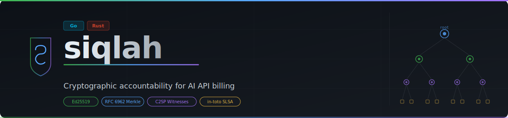

# siqlah

<p align="center">
  
</p>

<p align="center">
  <strong>Cryptographic accountability for AI API billing</strong><br>
  Verifiable Usage Receipts · Ed25519 &amp; Fulcio Keyless Signing · RFC 6962 Merkle Proofs · C2SP Witness Cosigning · Energy &amp; Carbon Reporting · x402 Payment Bridge
</p>

<p align="center">
  <a href="https://github.com/YASSERRMD/siqlah/actions/workflows/ci.yml">
    
  </a>
  <a href="https://pkg.go.dev/github.com/yasserrmd/siqlah">
    
  </a>
  <a href="LICENSE">
    
  </a>
  
  
</p>

---

## The Problem

Every major AI provider — OpenAI, Anthropic, Google — prints a token count in their API response. That number directly determines your invoice. Yet **no independent party verifies it**. You trust a JSON field.

siqlah closes this gap:

| Today | With siqlah |
|---|---|
| Provider reports tokens; you pay | Provider reports tokens; siqlah re-tokenizes locally and signs both |
| No audit trail | Append-only Merkle log (SQLite or Tessera) with inclusion proofs |
| Single point of trust | k-of-n C2SP witness cosigning; any party can verify |
| Billing disputes require provider cooperation | Cryptographic receipts verifiable offline |
| No sustainability visibility | Per-receipt energy and carbon footprint estimation |

---

## Architecture

See [`docs/architecture.md`](docs/architecture.md) for the full four-layer design, data flow, and threat model.

---

## How It Works

### 1 · Ingest

When your application calls an AI API, forward the raw response body to siqlah:

```
POST /v1/receipts   { provider, tenant, model, response_body }
```

siqlah parses token counts, re-tokenizes locally via the Rust engine, hashes the raw bytes, and returns a signed **VUR Receipt** — a canonical JSON record containing both provider-reported and locally-verified counts, an Ed25519 (or Fulcio keyless) signature, optional model identity verification, and energy/carbon estimates.

### 2 · Checkpoint

Every N receipts (or on a timer), siqlah builds a Merkle root over all canonical receipt bytes, signs a `SignedPayload`, and persists a **Checkpoint**. Each checkpoint embeds the previous root, forming an append-only hash chain. With the Tessera backend, checkpoints are also published as C2SP signed notes anchored to a transparency log.

### 3 · Witness

Independent witnesses fetch each checkpoint via the C2SP protocol, verify the operator signature, and co-sign with their own Ed25519 key. Clients configure which witnesses they trust and how many cosignatures are required (k-of-n). Checkpoints can also be anchored to the Rekor public transparency log for additional auditability.

### 4 · Verify

Anyone with the operator's public key can:
- Verify any receipt's signature offline
- Obtain a Merkle inclusion proof (`GET /v1/receipts/{id}/proof`) and verify it without trusting the server
- Obtain a consistency proof between two checkpoints to prove the log has not been rewritten
- Inspect energy and carbon footprint estimates per receipt

---

## Quick Start

### Docker (Recommended)

```bash
git clone https://github.com/YASSERRMD/siqlah
cd siqlah/deployments

# Start main service + two auto-cosigning witnesses
docker compose up -d

# Health check
curl http://localhost:8080/v1/health
```

### Build from Source

**Requirements:** Go 1.21+, Rust 1.70+, `gcc`/`clang` (CGo for tokenizer FFI)

```bash
git clone https://github.com/YASSERRMD/siqlah
cd siqlah

make build        # build all binaries (Rust tokenizer + Go)
make test         # run full test suite
```

Binaries produced in `bin/`:

| Binary | Purpose |
|---|---|
| `siqlah` | Main API server |
| `siqlah-witness` | Witness CLI: `keygen`, `cosign`, `verify`, `watch` |
| `siqlah-verifier` | Client verifier: receipt verify, inclusion proof, reconcile |

### First Receipt in 60 Seconds

```bash
# 1. Generate operator key
./bin/siqlah-witness keygen --out operator.key

# 2. Start server
./bin/siqlah --operator-key ./operator.key --db ./siqlah.db --addr :8080

# 3. Ingest an OpenAI response
curl -X POST http://localhost:8080/v1/receipts \
  -H 'Content-Type: application/json' \
  -d '{
    "provider": "openai",
    "tenant": "acme",
    "model": "gpt-4o",
    "response_body": {
      "id": "chatcmpl-abc123",
      "usage": {"prompt_tokens": 150, "completion_tokens": 75}
    }
  }'

# 4. Build a checkpoint
curl -X POST http://localhost:8080/v1/checkpoints/build

# 5. Verify
curl http://localhost:8080/v1/checkpoints/1/verify
```

See [`docs/quickstart.md`](docs/quickstart.md) for the full 5-minute tutorial including witness setup and local proof verification.

---

## Supported Providers

| Provider | `provider` value | Notes |
|---|---|---|
| OpenAI | `openai` | `o1`/`o3` reasoning tokens via `completion_tokens_details` |
| Anthropic | `anthropic` | Cache creation and cache read token fields |
| OpenAI-compatible | `generic` | Ollama, vLLM, LiteLLM, llama.cpp |

---

## API Overview

### Receipts

| Method | Path | Description |
|---|---|---|
| `POST` | `/v1/receipts` | Ingest a single API response |
| `POST` | `/v1/receipts/batch` | Ingest multiple responses |
| `GET` | `/v1/receipts/{id}` | Fetch a receipt by UUID |
| `GET` | `/v1/receipts/{id}/proof` | Merkle inclusion proof |
| `POST` | `/v1/receipts/with-payment` | Ingest with x402 payment authorization (`X-Payment` header) |
| `GET` | `/v1/receipts/{id}/payment` | Retrieve payment response for a paid receipt |

### Checkpoints

| Method | Path | Description |
|---|---|---|
| `POST` | `/v1/checkpoints/build` | Build and sign a checkpoint |
| `GET` | `/v1/checkpoints` | List checkpoints (paginated) |
| `GET` | `/v1/checkpoints/{id}` | Fetch a checkpoint |
| `GET` | `/v1/checkpoints/{id}/verify` | Verify operator sig + witness cosigs + Rekor anchor |
| `POST` | `/v1/checkpoints/{id}/witness` | Submit a witness cosignature (legacy) |
| `GET` | `/v1/checkpoints/{id}/consistency/{old_id}` | Consistency proof between checkpoints |

### Witness (C2SP)

| Method | Path | Description |
|---|---|---|
| `GET` | `/v1/witness/checkpoint` | Latest checkpoint as a C2SP signed note |
| `POST` | `/v1/witness/cosign` | Submit a C2SP witness cosignature |
| `GET` | `/v1/witness/cosigned-checkpoint` | Fully cosigned C2SP checkpoint note |
| `GET` | `/v1/log/checkpoint` | Raw C2SP signed note from Tessera backend |

### Stats & Health

| Method | Path | Description |
|---|---|---|
| `GET` | `/v1/health` | Liveness probe |
| `GET` | `/v1/stats` | Aggregate receipt and checkpoint counts |
| `GET` | `/v1/stats/energy` | Operator energy configuration and region |

Full reference: [`docs/api.md`](docs/api.md)

---

## Key Features

### Signing Backends

siqlah supports two signing backends, selectable with `--signing-backend`:

| Backend | Flag value | Description |
|---|---|---|
| Ed25519 (default) | `ed25519` | Operator-held private key; fast, simple |
| Fulcio keyless | `fulcio` | OIDC-based ephemeral certificate; no long-lived key required |

Fulcio-signed receipts include a `certificate_pem` field and optionally a `rekor_log_index` for the Rekor transparency log entry.

```bash
./bin/siqlah \
  --signing-backend fulcio \
  --fulcio-url https://fulcio.sigstore.dev \
  --oidc-issuer https://accounts.google.com \
  --rekor-url https://rekor.sigstore.dev
```

### Log Backends

| Backend | Flag value | Description |
|---|---|---|
| SQLite (default) | `sqlite` | Single-file embedded store; zero dependencies |
| Tessera | `tessera` | POSIX tile-based append-only log; C2SP signed note output |

> **Recommendation:** Use the Tessera backend for new deployments. It provides native C2SP witness cosigning, consistency proofs, and production-grade performance. The SQLite backend remains supported for zero-dependency environments and development. The internal `merkle` package is deprecated and retained only for the SQLite backend; all Merkle tree operations for Tessera go through the Tessera library directly.

```bash
./bin/siqlah \
  --log-backend tessera \
  --tessera-storage-path ./tessera-data/ \
  --tessera-log-name myorg.example/log
```

### Rekor Public Anchoring

Enable background anchoring of each new checkpoint to the Rekor public transparency log:

```bash
./bin/siqlah \
  --rekor-anchor \
  --rekor-url https://rekor.sigstore.dev \
  --rekor-anchor-interval 24h
```

Anchored checkpoints expose `rekor_anchored`, `rekor_log_index`, and `rekor_entry_url` in the verify response.

### C2SP Witness Protocol

The witness CLI speaks the [C2SP signed note](https://github.com/C2SP/C2SP/blob/main/signed-note.md) format, compatible with the Go transparency ecosystem:

```bash
# Generate a witness keypair
./bin/siqlah-witness keygen --out witness.key

# Cosign the latest checkpoint
./bin/siqlah-witness cosign \
  --ledger http://localhost:8080 \
  --key witness.key \
  --op-pub <operator-pub-hex>

# Continuously watch and cosign new checkpoints
./bin/siqlah-witness watch \
  --ledger http://localhost:8080 \
  --key witness.key \
  --op-pub <operator-pub-hex> \
  --interval 30s
```

### OMS Model Identity Verification

siqlah can verify model identity using [OMS (Open Model Specification)](https://github.com/openmodelinitiative) Sigstore bundles. When a valid bundle is provided at ingest time, the receipt is stamped with `model_signer_identity` and `model_signature_verified`. Without a bundle, a built-in registry of well-known models is consulted.

### Energy & Carbon Reporting

Every receipt includes optional energy and carbon footprint fields (schema v1.2.0):

| Field | Description |
|---|---|
| `energy_estimate_joules` | Estimated inference energy consumption |
| `energy_source` | Estimation method (`model-benchmark` or `none`) |
| `carbon_intensity_gco2e_per_kwh` | Grid carbon intensity for the inference region |
| `inference_region` | Cloud region used for carbon lookup |

Enable carbon reporting by specifying the inference region:

```bash
./bin/siqlah --inference-region us-east-1
```

Supported regions include major AWS, GCP, and Azure zones using Electricity Maps 2024 annual averages. Query the operator's current energy configuration at `GET /v1/stats/energy`.

### x402 Payment Bridge

siqlah implements the [HTTP 402 Payment Required](https://github.com/coinbase/x402) protocol for gating receipt ingestion behind on-chain payment authorization:

```bash
# Ingest with payment authorization
curl -X POST http://localhost:8080/v1/receipts/with-payment \
  -H 'Content-Type: application/json' \
  -H 'X-Payment: <base64-encoded-PaymentAuthorization>' \
  -d '{ "provider": "openai", ... }'

# Retrieve payment record for a receipt
curl http://localhost:8080/v1/receipts/{id}/payment
```

Without a valid `X-Payment` header, the endpoint returns HTTP 402 with a `PaymentRequired` body listing accepted payment schemes.

### Migration: SQLite → Tessera

Migrate an existing SQLite ledger to a Tessera backend without downtime:

```bash
./bin/siqlah migrate \
  --src siqlah.db \
  --dst tessera-data/ \
  --tessera-log-name myorg.example/log \
  --operator-key ./operator.key \
  --batch-size 500 \
  --dry-run   # omit to perform the actual migration
```

See [`docs/migration-v0.1-to-v0.2.md`](docs/migration-v0.1-to-v0.2.md) for the step-by-step upgrade guide and rollback procedure.

---

## Security & Threat Model

| Threat | Mitigation |
|---|---|
| Provider inflates token counts | Rust tokenizer re-verifies locally; discrepancy monitor alerts |
| Operator inflates token counts | Ed25519/Fulcio signature binds counts at signing time; client verifies |
| Log tampered after the fact | RFC 6962 Merkle inclusion and consistency proofs; C2SP witness cosignatures |
| Single-operator trust | Witness network; k-of-n cosigning; Rekor public anchoring |
| Replay attacks | Unique receipt UUID; timestamp in signed payload |
| Key compromise | Checkpoint chain breaks; detectable; Fulcio keyless eliminates long-lived keys |
| Fraudulent model identity | OMS Sigstore bundle verification; built-in model registry |

---

## Documentation

| Document | Description |
|---|---|
| [`docs/quickstart.md`](docs/quickstart.md) | 5-minute tutorial |
| [`docs/api.md`](docs/api.md) | Full API reference |
| [`docs/architecture.md`](docs/architecture.md) | Four-layer design, data flow, threat model |
| [`docs/receipt-spec.md`](docs/receipt-spec.md) | VUR receipt format and canonical serialization spec |
| [`docs/witness-protocol.md`](docs/witness-protocol.md) | Witness verification and cosigning protocol |
| [`docs/witness-interop.md`](docs/witness-interop.md) | Connecting to Sigsum, Armored Witness, and other external witnesses |
| [`docs/migration-v0.1-to-v0.2.md`](docs/migration-v0.1-to-v0.2.md) | SQLite → Tessera upgrade guide and rollback |
| [`docs/interop.md`](docs/interop.md) | C2SP, Sigstore bundle, Rekor v2, x402 interoperability reference |
| [`docs/docker.md`](docs/docker.md) | Docker and Docker Compose deployment guide |
| [`docs/attestation.md`](docs/attestation.md) | In-toto/SLSA attestation — cosign, GUAC, and OPA integration |
| [`CONTRIBUTING.md`](CONTRIBUTING.md) | Development guide |
| [`CHANGELOG.md`](CHANGELOG.md) | Release history |

---

## Comparison

| Approach | Trust Model | Verifiability | Token-Level | Keyless Signing | Carbon Reporting | Ecosystem Interop |
|---|---|---|---|---|---|---|
| **siqlah** | Multi-party witness, Ed25519/Fulcio | Cryptographic inclusion proofs | Yes (Rust FFI) | Yes (Fulcio) | Yes | Sigstore, C2SP, Armored Witness, in-toto/SLSA |
| Hyperledger Fabric | Permissioned blockchain | On-chain audit | No | No | No | None |
| x402 (HTTP payment) | Blockchain settlement | Payment proof only | No | No | No | None |
| ZKML | ZK proofs of inference | Strong but expensive | Yes (heavy) | No | No | None |
| Provider billing APIs | Trust provider | None | No | No | No | None |

siqlah occupies the pragmatic middle ground: cryptographically strong, operationally simple, no blockchain required.

---

## License

Polyform Noncommercial License 1.0.0 — free to use, modify, and distribute; commercial use is prohibited. See [LICENSE](LICENSE).

Copyright 2026 [YASSERRMD](https://github.com/YASSERRMD)
