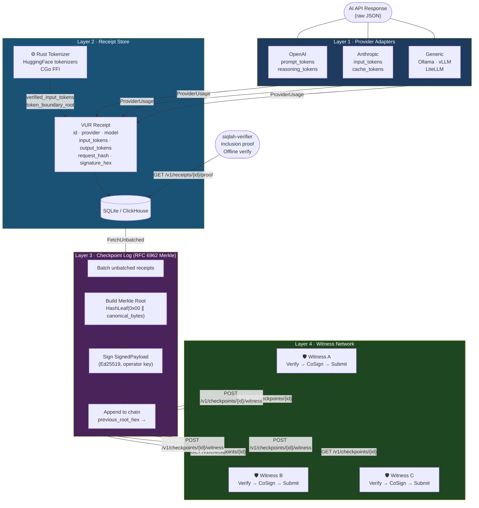

# Architecture Diagram — Google AI Studio Prompt

Use the prompt below with **Google AI Studio** (Gemini) at [aistudio.google.com](https://aistudio.google.com) to generate a professional architecture diagram for siqlah. After generating, save the image to `docs/architecture.png` and update the README placeholder.

---

## How to Use

1. Open [Google AI Studio](https://aistudio.google.com)
2. Select **Gemini 2.0 Flash** (or the latest Gemini model with image generation)
3. Paste the prompt below
4. Download the generated image
5. Save it as `docs/architecture.png`
6. Replace the ASCII block in `README.md` with:
   ```markdown
   
   ```

---

## Prompt

```
Create a professional, clean software architecture diagram for a system called "siqlah" — a Verifiable Usage Receipt (VUR) system for AI API billing.

The diagram should use a modern, minimalist style with a dark navy (#0D1117) or white background, clean sans-serif typography, and a cohesive color palette. Use icons where appropriate (lock for signing, tree for Merkle, shield for witness).

The diagram has four horizontal layers stacked vertically, with data flowing from bottom to top on the left side and verification flowing from top to bottom on the right side.

---

LAYER 1 (bottom) — PROVIDER ADAPTERS
Color: Deep blue (#1E3A5F)
Label: "Layer 1 · Provider Adapters"
Contents (three boxes side by side):
- OpenAI Adapter (supports reasoning tokens: o1, o3)
- Anthropic Adapter (supports cache tokens)
- Generic Adapter (Ollama, vLLM, LiteLLM)
Description below: "Parses raw provider JSON → normalized ProviderUsage struct"

LAYER 2 — RECEIPT STORE
Color: Teal (#1A5276)
Label: "Layer 2 · Receipt Store"
Contents:
- Left box: "VUR Receipt" with fields listed: UUID · provider · model · input_tokens · output_tokens · request_hash · response_hash · signer_identity · signature_hex · verified
- Right box: "Rust Tokenizer Engine" labeled "Independent re-tokenization via HuggingFace tokenizers crate (CGo FFI)" with a small gear icon
- Arrow from Rust box to Receipt box labeled "verified_input_tokens, verified_output_tokens, token_boundary_root"
- Storage icons for "SQLite (dev)" and "ClickHouse / TimescaleDB (prod)" at the bottom of this layer
Description: "Ed25519-signed canonical receipts · SHA-256 request/response hashes · Merkle root over token boundaries"

LAYER 3 — CHECKPOINT LOG
Color: Purple (#4A235A)
Label: "Layer 3 · Checkpoint Log"
Contents:
- A Merkle tree diagram (triangle shape) with leaf nodes labeled "H(receipt₁)", "H(receipt₂)", "...", "H(receiptₙ)" and the root labeled "Merkle Root"
- Box labeled "SignedPayload" with fields: batch_start · batch_end · tree_size · root_hex · previous_root_hex · issued_at
- Arrow from SignedPayload to a key icon labeled "Ed25519 (operator key)"
- A chain of three small checkpoint boxes linked by arrows labeled "previous_root_hex →" to show the append-only chain
Description: "RFC 6962 domain-separated hash tree · append-only chain · consistency-provable"

LAYER 4 (top) — WITNESS NETWORK
Color: Dark green (#1E4620)
Label: "Layer 4 · Witness Network"
Contents:
- Three boxes labeled "Witness A", "Witness B", "Witness C" each with a shield icon
- Each witness has a step list: "1. GET /v1/checkpoints/{id}" → "2. Verify operator sig" → "3. Ed25519 cosign" → "4. POST /v1/checkpoints/{id}/witness"
- A "k-of-n Cosigning" badge between the witnesses
Description: "Independent parties · no on-chain coordination · C2SP-compatible"

---

DATA FLOW (left side, flowing upward):
Draw a vertical arrow on the left labeled "DATA FLOW" with these labeled steps from bottom to top:
1. "AI API Response (raw JSON)"
2. "ParseUsage() → ProviderUsage"
3. "SignReceipt() → VUR Receipt"
4. "BatchAndSign() → Checkpoint"
5. "CoSign() → Witnessed Checkpoint"

VERIFICATION FLOW (right side, flowing downward):
Draw a vertical arrow on the right labeled "VERIFICATION" with these labeled steps from top to bottom:
1. "Client: GET /v1/receipts/{id}/proof"
2. "Merkle inclusion proof (leaf + siblings)"
3. "VerifyInclusion(leaf, root, proof)"
4. "VerifyReceipt(receipt, operatorPubKey)"
5. "Result: tamper-evident, independently verifiable"

---

BOTTOM SECTION — HTTP API SUMMARY
Add a narrow bar at the very bottom labeled "REST API  ·  :8080" with these endpoint pills in a row:
POST /v1/receipts · GET /v1/receipts/{id}/proof · POST /v1/checkpoints/build · GET /v1/checkpoints/{id}/verify · POST /v1/checkpoints/{id}/witness · GET /v1/checkpoints/{id}/consistency/{old_id}

---

TITLE BLOCK (top of diagram):
Large text: "siqlah · سِقلة"
Subtitle: "Verifiable Usage Receipt System for AI API Billing"
Tagline in smaller text: "Ed25519 · RFC 6962 Merkle Trees · k-of-n Witness Cosigning · No Blockchain Required"

---

Overall style: professional technical whitepaper / GitHub README quality. Clean lines, consistent iconography, readable at 1200×900px. Export as PNG with transparent or white background.
```

---

## Alternative: Mermaid Diagram (no AI required)

If you prefer a code-generated diagram, paste this into any Mermaid renderer (e.g., [mermaid.live](https://mermaid.live)):



Save the rendered SVG as `docs/architecture.svg` and reference it in the README.
